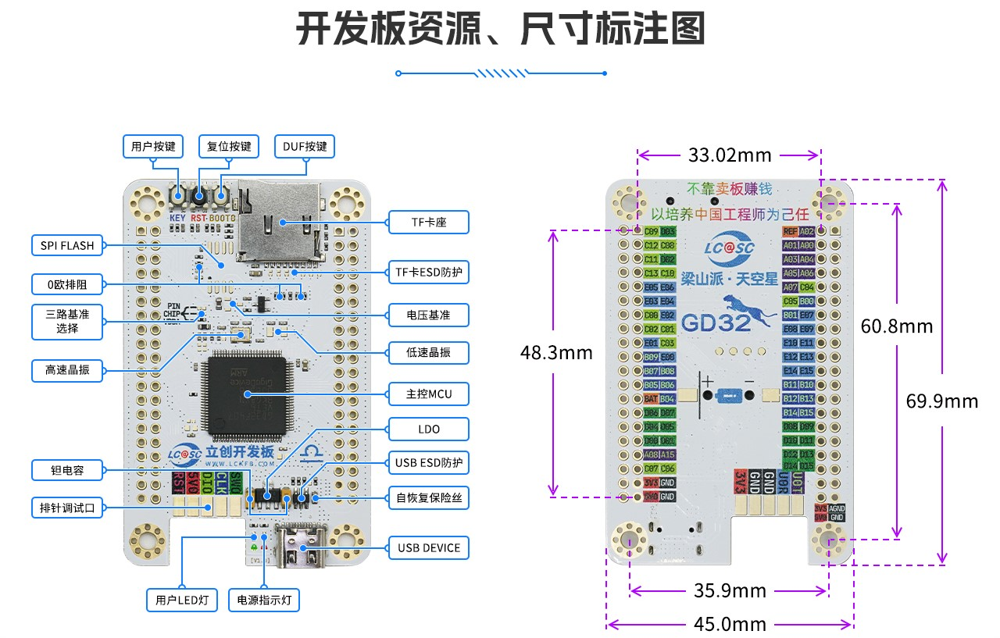
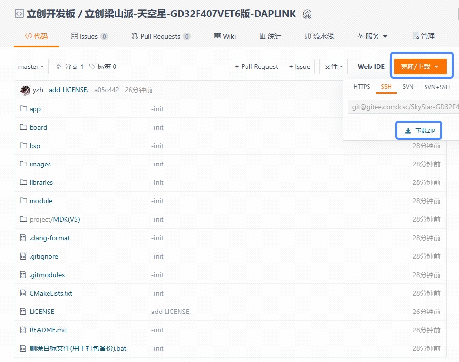
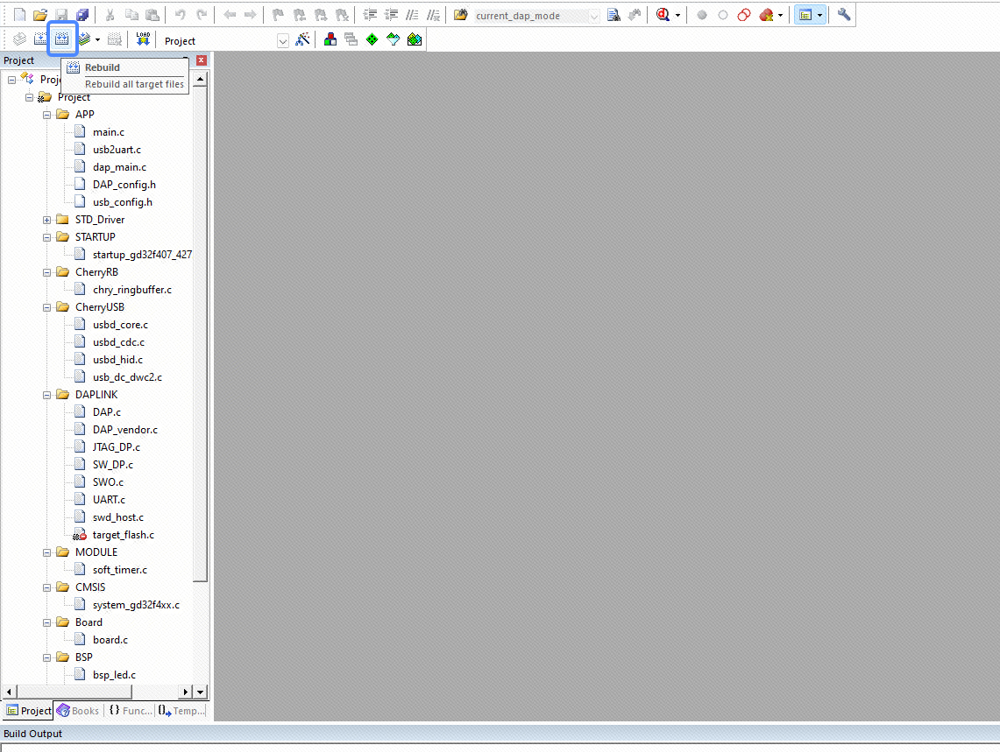
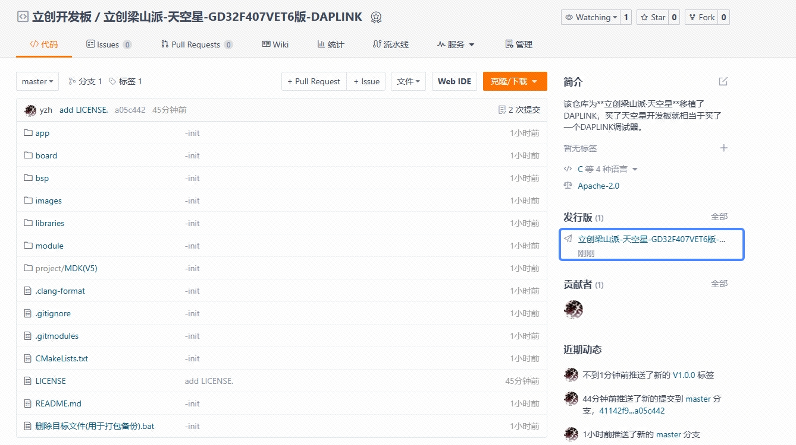
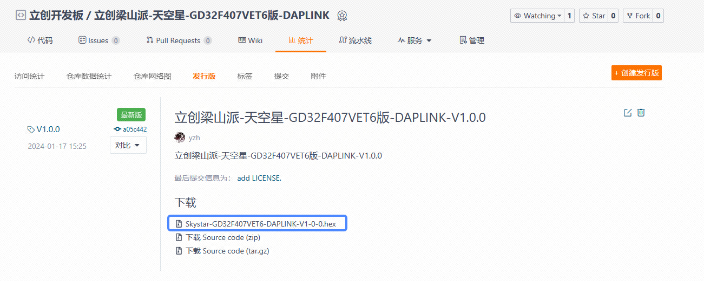
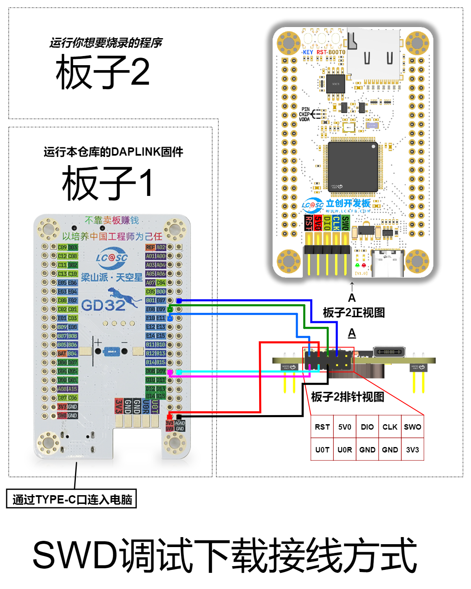
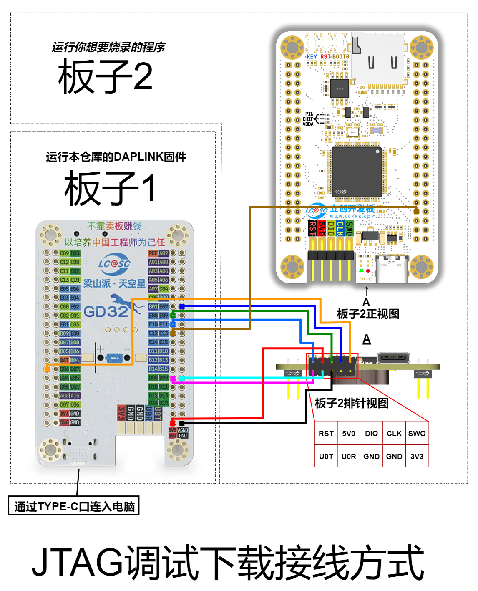

# 立创梁山派·天空星-GD32F407VET6版-DAPLINK

# 介绍

该仓库为**立创梁山派·天空星**移植了DAPLINK，买了天空星开发板就相当于买了一个DAPLINK调试器。

引脚定义如下

| DAPLINK功能 | 芯片引脚 | 芯片引脚号 | 芯片复用功能 |
| ----------- | -------- | ---------- | ------------ |
| CDC_TX      | D08      | 55         | USART2_TX    |
| CDC_RX      | D09      | 56         | USART2_RX    |
| TCK/SWCLK   | E07      | 38         | /            |
| TMS/SWDIO   | E08      | 39         | /            |
| NRST        | E10      | 41         | /            |
| TDI         | E12      | 43         | /            |
| TDO(SWO)    | D06      | 87         | USART1_RX    |

# 如何获取固件

## 自行编译

`git clone` 本仓库或者点击【克隆/下载】直接下载zip压缩包。

进入目录`SkyStar-GD32F407VET6-DAPLINK-master\project\MDK(V5)`并双击打开`project.uvprojx`

进入MDK（KEIL）界面后单击全编译按钮。

编译完成后，`SkyStar-GD32F407VET6-DAPLINK-master\SkyStar-GD32F407VET6-DAPLINK-master\project\MDK(V5)\Objects`目录下的`project.hex`即为我们需要的固件。

## 下载发行版中的附件

单击[立创梁山派-天空星-GD32F407VET6版-DAPLINK-V1.0.0](https://gitee.com/lcsc/SkyStar-GD32F407VET6-DAPLINK/releases/tag/V1.0.0)

下载`Skystar-GD32F407VET6-DAPLINK-V1-0-0.hex`

# 如何将固件下载到立创天空星里面

## MDK使用外部调试器直接下载

如果有外部调试器比如其他的DAPLINK（比如之前梁山派自带的下载器），Jlink，将立创梁山派·天空星开发板焊接好下载排针。连入外部下载器，打开MDK（KEIL），选好你使用的下载器。其他就和下载普通程序一样了。详情请参考**[【立创·梁山派-天空星】入门手册](https://lceda001.feishu.cn/wiki/Zawdwg0laig3Qnk2XuxcKrQRn2g)**，其中【程序下载】章节中的DAP-LINK下载有详细介绍。

## 使用GD32官方上位机进行下载

下载好上面的`hex固件`，打开GD32官方的DFU下载工具。具体操作步骤参考[【立创·梁山派-天空星】入门手册](https://lceda001.feishu.cn/wiki/Zawdwg0laig3Qnk2XuxcKrQRn2g)，其中【程序下载】章节中的DFU下载有详细介绍，只不过在*下载代码测试*环节中下载的hex固件变为你上面获取到的固件。

# 如何使用天空星版的DAPLINK

以下说明均以调试立创·梁山派-天空星为例，当前固件实现了**CDC模拟串口**及**SW下载**和**JTAG下载**。在WIN10，WIN11系统上是免驱的。具体引脚定义如下。

| DAPLINK功能 | 芯片引脚 | 芯片引脚号 | 芯片复用功能 |
| ----------- | -------- | ---------- | ------------ |
| CDC_TX      | D08      | 55         | USART2_TX    |
| CDC_RX      | D09      | 56         | USART2_RX    |
| TCK/SWCLK   | E07      | 38         | /            |
| TMS/SWDIO   | E08      | 39         | /            |
| NRST        | E10      | 41         | /            |
| TDI         | E12      | 43         | /            |
| TDO(SWO)    | D06      | 87         | USART1_RX    |

> **板子1**运行本仓库的`DAPLINK固件`，**板子2**就是你`要调试的目标板`，运行你想要烧录的程序。
>
> 接下来的烧录环境以MDK（KEIL）为例，其他环境的使用方法请查看常规DAPLINK的使用方法，是一样的。

## SWD下载

### 接线图

### 实际烧录

> 用杜邦线（用好一点的哦，硅胶超软杜邦线最好）按照上图连接好，打开随便一个开发板的例程，开始下载调试。动图示例如下：
>
> 同时展示下载和CDC串口接收

## JTAG下载

### 接线图

### 实际烧录

> 用杜邦线（用好一点的哦，硅胶超软杜邦线最好）按照上图连接好，打开随便一个开发板的例程，开始下载调试。动图示例如下：
>
> 同时展示下载和CDC串口接收

# 使用的开源仓库

* [DAPLink](https://github.com/ARMmbed/DAPLink)
* [CherryUSB](https://github.com/cherry-embedded/CherryUSB)
* [CherryDAP](https://github.com/cherry-embedded/CherryDAP)
* [CherryRB](https://github.com/cherry-embedded/CherryRB)